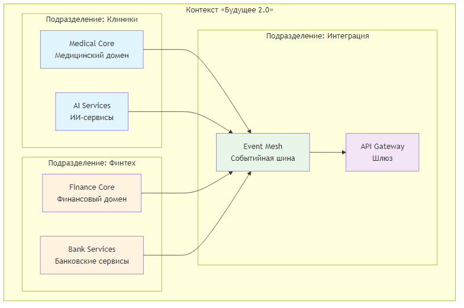
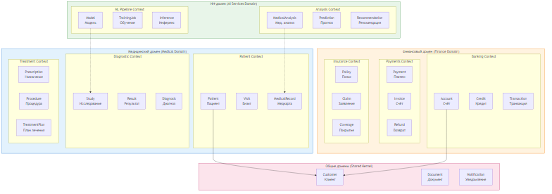
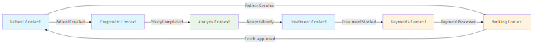
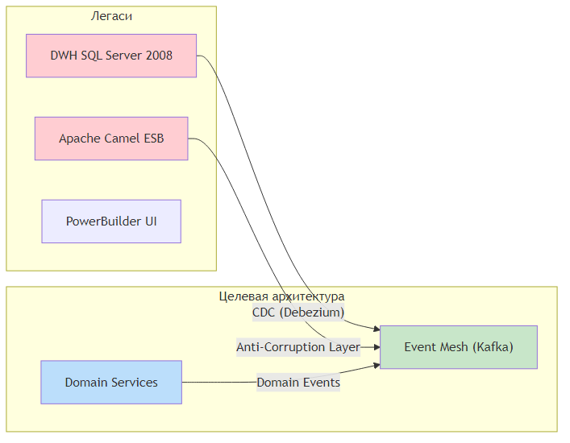

# Bounded Contexts для компании «Будущее 2.0»

## Обзорная диаграмма Bounded Contexts

[Исходный файл Mermaid](diagrams/overview_diagram.mmd)

## Детальная схема Bounded Contexts с Ubiquitous Language

[Исходный файл Mermaid](diagrams/detailed_contexts.mmd)

## Матрица Bounded Contexts и их ответственностей

| Bounded Context | Основная ответственность | Ключевые сущности | Коммуникация |
|-----------------|------------------------|-------------------|--------------|
| **Patient Context** | Управление данными пациентов | Patient, Visit, ContactInfo | События через Kafka |
| **Diagnostic Context** | Управление медицинскими исследованиями | Study, Result, Image | CDC DWH |
| **Treatment Context** | Назначение и отслеживание лечения | Prescription, Procedure, TreatmentPlan | События |
| **Banking Context** | Управление банковскими продуктами | Account, Credit, Loan | Синхронный REST + события |
| **Payments Context** | Обработка платежей | Payment, Invoice, Refund | События |
| **Insurance Context** | Страховые продукты и покрытия | Policy, Claim, Coverage | События |
| **ML Pipeline Context** | Управление ML-моделями | Model, TrainingJob, Inference | Асинхронные события |
| **Analysis Context** | Анализ мед. данных и прогнозы | MedicalAnalysis, Prediction | Подписка на события |
| **Shared Kernel** | Общие справочники | Customer, Document, Notification | Библиотека общих контрактов |

## Карта интеграций между Bounded Contexts

[Исходный файл Mermaid](diagrams/integration_map.mmd)

## Связь с текущей архитектурой (миграция)

[Исходный файл Mermaid](diagrams/migration_architecture.mmd)

## Ключевые доменные события (Business Events)

### Медицинский домен
- `PatientRegistered` - Зарегистрирован новый пациент
- `PatientUpdated` - Обновлены данные пациента
- `StudyOrdered` - Назначено исследование
- `StudyCompleted` - Исследование завершено
- `DiagnosisEstablished` - Установлен диагноз
- `TreatmentPrescribed` - Назначено лечение

### Финансовый домен
- `AccountCreated` - Создан счёт
- `CreditApplicationSubmitted` - Подана заявка на кредит
- `CreditApproved` - Кредит одобрен
- `PaymentInitiated` - Инициирован платёж
- `PaymentCompleted` - Платёж завершён
- `InvoiceGenerated` - Сформирован счёт

### ИИ-домен
- `AnalysisRequested` - Запрошен анализ
- `ModelTrainingStarted` - Начато обучение модели
- `ModelTrainingCompleted` - Обучение завершено
- `InferenceCompleted` - Инференс выполнен
- `PredictionGenerated` - Сгенерирован прогноз

### События кросс-доменного взаимодействия
- `CustomerVerified` - Клиент верифицирован
- `DocumentReceived` - Документ получен
- `NotificationSent` - Уведомление отправлено
