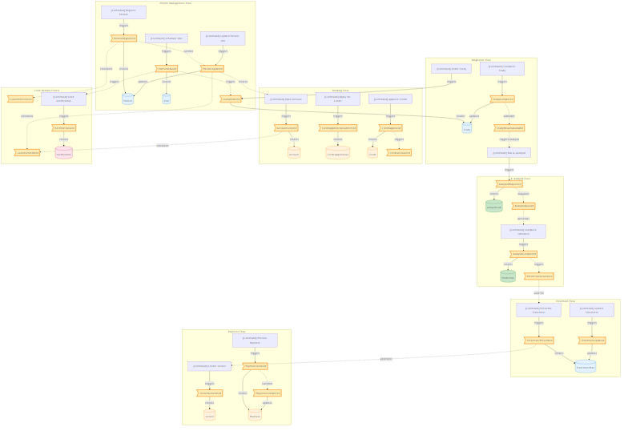
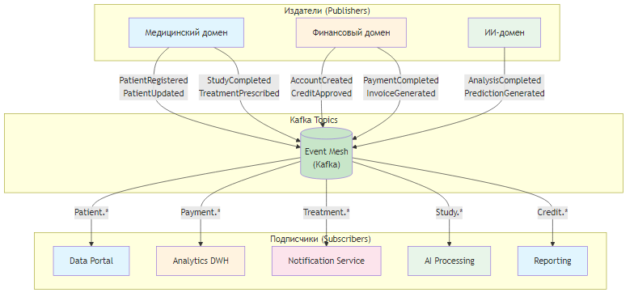
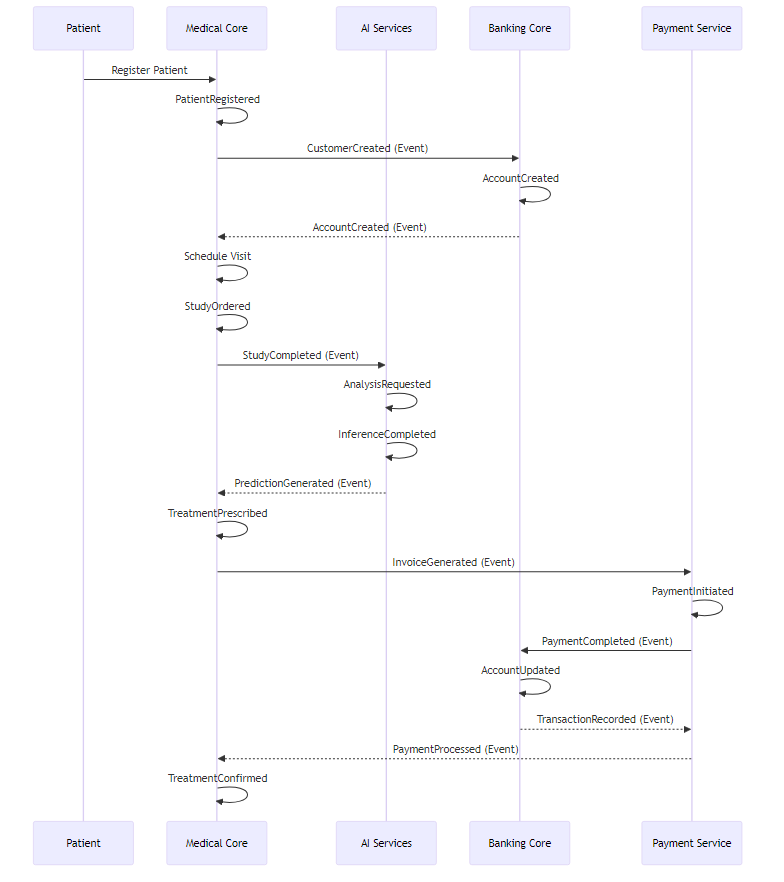

# Event Storming диаграмма для «Будущее 2.0»

## Полная Event Storming схема

[Исходный файл Mermaid](diagrams/full_storming.mmd)

## Схема публикации/подписки событий

[Исходный файл Mermaid](diagrams/pub_sub.mmd)

## Временная шкала событий (Saga Pattern)

[Исходный файл Mermaid](diagrams/event_timeline.mmd)

## Ключевые события и их связь с доменами

| Событие | Источник (Domain) | Подписчики | Описание |
|---------|-------------------|------------|----------|
| `PatientRegistered` | Medical | Banking, Portal | Регистрация нового пациента |
| `PatientUpdated` | Medical | Banking, Portal | Обновление данных пациента |
| `StudyCompleted` | Medical | AI, Portal | Завершение медицинского исследования |
| `DiagnosisEstablished` | Medical | AI, Insurance | Установка диагноза |
| `TreatmentPrescribed` | Medical | Payment, Portal | Назначение лечения |
| `AccountCreated` | Banking | Medical, Portal | Создание банковского счёта |
| `CreditApplicationSubmitted` | Banking | Medical | Подача заявки на кредит |
| `CreditApproved` | Banking | Medical, Portal | Одобрение кредита |
| `PaymentCompleted` | Payment | Medical, Reporting | Завершение платежа |
| `InvoiceGenerated` | Payment | Medical, Banking | Генерация счёта |
| `AnalysisRequested` | AI | Medical | Запрос на анализ |
| `PredictionGenerated` | AI | Medical | Сгенерирован прогноз |
| `NotificationSent` | Shared | All | Отправка уведомления |
