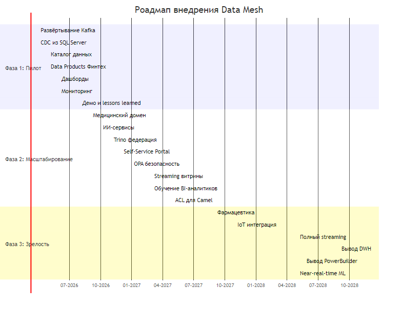

# Стратегический роадмап внедрения Data Mesh

## Введение

Данный документ описывает стратегический план внедрения Data Mesh в компании «Будущее 2.0». Data Mesh — это децентрализованный подход к управлению данными, который позволяет доменам владеть своими данными как продуктами, обеспечивая при этом федеративное управление и самообслуживание аналитики.

---

## Ключевые роли Data Mesh

### 1. Data Product Owner (Владелец продукта данных)

**Зона ответственности:**
- Определение бизнес-ценности данных в домене
- Управление жизненным циклом данных (от создания до архивирования)
- Обеспечение качества и доступности данных
- Определение SLA для потребителей данных
- Взаимодействие с бизнес-пользователями

**Компетенции:**
- Понимание бизнес-процессов домена
- Основы управления данными (data governance)
- Коммуникационные навыки
- Базовое понимание технической архитектуры

**Количество:** 1 на домен (всего 4)

**Связь с бизнес-целями:**
- Создание самообслуживаемых витрин данных
- Обеспечение соответствия требованиям регуляторов
- Повышение качества данных

---

### 2. Data Engineer (Инженер данных)

**Зона ответственности:**
- Разработка и поддержка пайплайнов данных
- Реализация CDC (Change Data Capture) из источников
- Создание и управление streaming-потоками
- Обеспечение качества данных
- Разработка API для доступа к данным
- Интеграция с Event Mesh (Kafka)

**Компетенции:**
- Глубокое знание SQL и языков программирования (Python, Scala)
- Опыт работы с Apache Kafka и стримингом
- Понимание архитектуры данных (Data Lake, Data Lakehouse)
- Опыт работы с контейнерами и Kubernetes

**Количество:** 1-2 на домен (всего 6-8)

**Связь с бизнес-целями:**
- Обеспечение доступности данных в реальном времени
- Масштабируемость обработки данных
- Надёжность и отказоустойчивость

---

### 3. BI-аналитик (BI Analyst)

**Зона ответственности:**
- Создание отчётов и дашбордов
- Анализ данных и выявление инсайтов
- Конструирование ad-hoc запросов
- Обучение бизнес-пользователей работе с данными
- Содействие в определении требований к данным

**Компетенции:**
- Экспертиза в BI-инструментах (Superset, DataLens)
- Знание SQL и аналитических методов
- Понимание бизнес-процессов компании
- Навыки визуализации данных

**Количество:** 1-2 на домен + 2 кросс-доменных (всего 6-8)

**Связь с бизнес-целями:**
- Ускорение принятия решений на основе данных
- Self-service аналитика для бизнес-пользователей
- Мониторинг KPI

---

### 4. Platform Engineer (Инженер платформы)

**Зона ответственности:**
- Управление инфраструктурой Data Mesh
- Обеспечение безопасности и compliance
- Поддержка каталога данных (DataHub)
- Мониторинг и observability
- Управление правами доступа

**Количество:** 2-3

---

## Матрица ролей и фаз

| Роль | Фаза 1 (Пилот) | Фаза 2 (Масштабирование) | Фаза 3 (Зрелость) |
|------|-----------------|---------------------------|-------------------|
| Data Product Owner | 1 (Финтех) | +2 (Медицина, ИИ) | +1 (новые домены) |
| Data Engineer | 2 | +4 | +2 |
| BI-аналитик | 2 | +4 | +2 |
| Platform Engineer | 2 | +1 | - |

---

## Фазы внедрения

### Фаза 1: Пилот (0-6 месяцев)

**Цель:** Проверить подход Data Mesh на одном домене, создать фундамент

**Бизнес-цели:**
- Подтвердить архитектурные решения
- Получить реальный опыт работы с Data Mesh
- Создать демонстрационный кейс для масштабирования

**Домен пилота:** Финансовый домен (Финтех)

**Причины выбора:**
- Наиболее структурированные данные
- Чёткие бизнес-процессы
- Высокий потенциал быстрых побед
- Готовность команды к изменениям

**Задачи:**

| Задача | Ответственный | Месяц |
|--------|---------------|-------|
| Развернуть Kafka-кластер | Platform Engineer | 1 |
| Настроить CDC из SQL Server | Data Engineer | 1-2 |
| Создать каталог данных (DataHub) | Platform Engineer | 2 |
| Определить Data Product для Финтеха | Data Product Owner | 2 |
| Разработать первые потоки данных | Data Engineer | 2-3 |
| Создать базовые дашборды | BI-аналитик | 3-4 |
| Настроить мониторинг | Platform Engineer | 3 |
| Провести демо для стейкхолдеров | Data Product Owner | 4-5 |
| Документировать lessons learned | Все | 5-6 |

**Результаты фазы 1:**
- Работающий Kafka-кластер
- 5-10 опубликованных событий
- 2-3 Data Products
- 5 дашбордов для бизнеса
- Документированные практики

**Метрики успеха:**
- Время создания нового отчёта: < 1 день (vs. 1 неделя)
- Доступность данных: 99,5%
- Количество потребителей данных: 20+

---

### Фаза 2: Масштабирование (6-18 месяцев)

**Цель:** Распространить Data Mesh на критические домены

**Бизнес-цели:**
- Охватить все основные домены
- Обеспечить кросс-доменную аналитику
- Внедрить Self-Service BI

**Домены:**
- Медицинский домен
- ИИ-сервисы
- Начало интеграции с клиниками

**Задачи:**

| Задача | Ответственный | Период |
|--------|---------------|--------|
| Подключить Медицинский домен | Data Engineer | 6-9 |
| Подключить ИИ-сервисы | Data Engineer | 7-10 |
| Внедрить Trino для федеративных запросов | Platform Engineer | 8-10 |
| Развернуть Self-Service Portal | Platform Engineer + BI | 9-12 |
| Внедрить OPA для безопасности | Platform Engineer | 10-12 |
| Запустить streaming витрины | Data Engineer | 12-15 |
| Обучить BI-аналитиков доменов | BI-аналитики | 12-14 |
| Интеграция с легаси (Camel) через ACL | Platform Engineer | 14-18 |

**Результаты фазы 2:**
- 4 домена с Data Mesh
- Единый слой федеративных запросов
- Self-Service Portal в production
- Streaming витрины для ключевых показателей
- ACL-слой для интеграции с легаси

**Метрики успеха:**
- Time-to-market для новых данных: < 1 неделя
- Количество Data Products: 20+
- Количество активных пользователей: 100+
- Кросс-доменные запросы: 50+/день

---

### Фаза 3: Поддержка доменов и зрелость (18-36 месяцев)

**Цель:** Достичь целевого состояния Data Mesh, вывести легаси

**Бизнес-цели:**
- Полная автономия доменов
- Near-real-time аналитика
- Интеграция новых бизнес-направлений

**Задачи:**

| Задача | Ответственный | Период |
|--------|---------------|--------|
| Интеграция фармацевтических данных | Data Engineer | 18-24 |
| Интеграция IoT/оборудования | Data Engineer | 20-26 |
| Полный переход на streaming | Data Engineer | 24-28 |
| Вывод DWH из эксплуатации | Platform Engineer | 28-30 |
| Вывод PowerBuilder из эксплуатации | Platform Engineer | 30-32 |
| Near-real-time ML inference | ML Engineers | 26-32 |
| Governance и compliance automation | Platform Engineer | 30-36 |

**Результаты фазы 3:**
- 6+ доменов в Data Mesh
- Near-real-time аналитика
- Легаси-системы выведены
- Автоматизированный governance

**Метрики успеха:**
- Время от события до аналитики: < 1 минута
- Полная автономия доменов
- 0 downtime для аналитики

---

## Связь с бизнес-целями компании

### Промежуточное состояние (через пару месяцев)

| Бизнес-цель | Результат Data Mesh |
|-------------|---------------------|
| Архитектурное решение сформировано | Пилот подтвердил архитектуру |
| Границы доменов определены | Bounded Contexts для Финтеха |
| Проекты витрин данных запланированы | Roadmap согласован |

### Финальное состояние (через год)

| Бизнес-цель | Результат Data Mesh |
|-------------|---------------------|
| Реализован портал самообслуживания | Self-Service Portal в production |
| Бизнес-пользователи работают с данными | 100+ активных пользователей |
| Легаси сохранён в отдельных доменах | ACL-мост функционирует |

### Долгосрочная цель (3 года)

| Бизнес-цель | Результат Data Mesh |
|-------------|---------------------|
| Слабосвязанная событийная платформа | Event Mesh — основная интеграция |
| 3 направления масштабирования | 6+ доменов готовы |
| Near-real-time обработка | < 1 минуты latency |

---

## Диаграмма Ганта

[Исходный файл Mermaid](diagrams/gantt_chart.mmd)

---

## Управление рисками

| Риск | Вероятность | Влияние | Митигация |
|------|-------------|---------|-----------|
| Сопротивление изменениям | Высокая | Высокое | Коммуникация, демонстрация ценности |
| Недостаток экспертизы | Средняя | Высокое | Обучение, привлечение консультантов |
| Сложность интеграции с легаси | Высокая | Среднее | ACL, постепенная миграция |
| Качество данных | Средняя | Высокое | Data Quality Checks, SLA |
| Масштабируемость | Низкая | Высокое | Архитектура с запасом |

---

## Бюджет по фазам

| Фаза | Период | Бюджет (млн ₽) |
|------|--------|----------------|
| Фаза 1: Пилот | 0-6 мес | 35,0 |
| Фаза 2: Масштабирование | 6-18 мес | 65,0 |
| Фаза 3: Зрелость | 18-36 мес | 45,0 |
| **Итого** | **36 мес** | **145,0** |

---

## Критические факторы успеха

1. **Поддержка руководства** — Спонсорство на уровне C-level
2. **Выделенные команды** — Выделенные ресурсы, а не совмещение
3. **Постепенность** — Эволюционный подход, не революция
4. **Обучение** — Инвестиции в развитие компетенций
5. **Метрики** — Измерение прогресса и ценности
6. **Коммуникация** — Регулярное информирование стейкхолдеров
